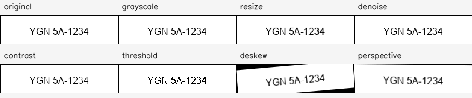

# Plate preprocessing

**Milestone:** Day 6 — Plate preprocessing

**Branch:** `feat/plate-preprocessing`

**Input contract:** an unchanged Day 5 `uint8` grayscale or three-channel BGR
plate crop.

## Service contract

`PlatePreprocessingService.preprocess(crop, options)` returns a copied original,
original shape/type metadata, only the explicitly requested variants, per-stage
metadata and elapsed milliseconds, and total elapsed milliseconds. It never
modifies the caller's crop.

Every variant is derived independently from the original. Selecting threshold,
denoise, and grayscale together therefore does not create an implicit
threshold-to-denoise-to-grayscale chain. An empty stage selection returns the
preserved original with no variants.

| Stage | Output | Configuration |
|---|---|---|
| `grayscale` | `uint8` single-channel | BGR-to-gray; grayscale input is copied |
| `resize` | Original channel count | Target width; height preserves aspect ratio |
| `denoise` | Original shape/type | Bounded odd bilateral-filter diameter |
| `contrast` | `uint8` single-channel | CLAHE clip limit and grid size |
| `threshold` | Binary `uint8` single-channel | Otsu threshold derived from the original |
| `deskew` | Original shape/type | Explicit bounded angle; replicated borders |
| `perspective` | Requested bounded shape | Explicit top-left, top-right, bottom-right, bottom-left points and output size |

Deskew and perspective are optional and require explicit parameters. The
service does not estimate an angle or corners, because automatic estimation
has not been evaluated. Output dimensions and option ranges are bounded.
Invalid crops/options raise a stable `PlatePreprocessingError` code without
including image data or local paths.

## Reproducible visual example



The contact sheet uses only the repository-generated
`sample-data/evaluation/synthetic_plate_white.png` fixture and its versioned
ground-truth crop `(220, 320, 420, 370)`. It demonstrates transformation
behavior, not OCR improvement or real-world plate quality. Regenerate it from
the repository root:

```powershell
backend\.venv\Scripts\python.exe scripts\generate_preprocessing_examples.py
```

The displayed deskew angle and perspective corners are deliberately explicit
demonstration inputs. Day 6 does not select OCR, measure OCR accuracy, or claim
that every variant is useful for every plate.
